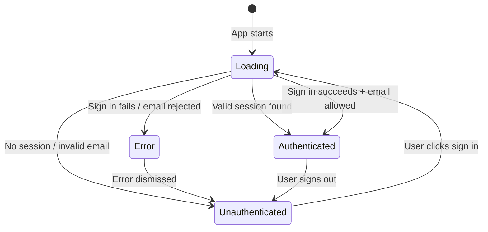
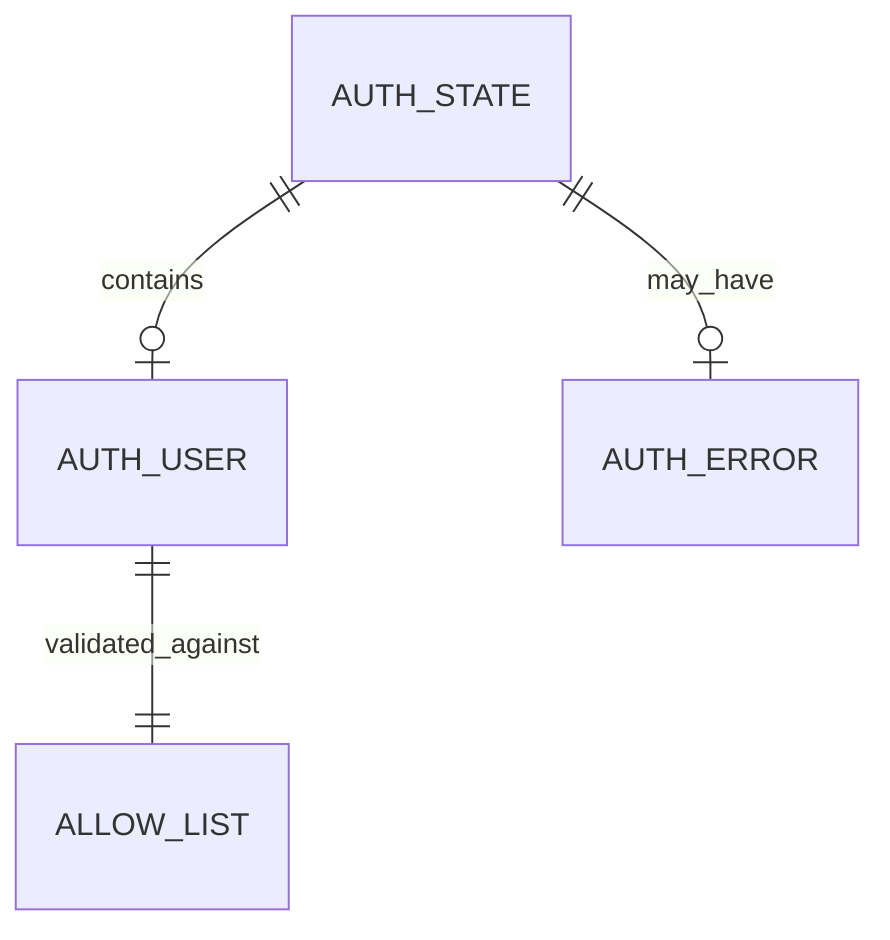

# Data Model: Google Authentication via Firebase

**Feature Branch**: `001-google-auth`
**Created**: 2026-01-10
**Status**: Complete

## Overview

This feature introduces authentication to the shopping list application. The data model is minimal since Firebase handles all user data storage and session management. We only define TypeScript interfaces for type safety.

## Entities

### 1. AuthUser

Represents an authenticated user from Firebase. This is a subset of Firebase's `User` type, containing only the fields we use.

```typescript
/**
 * Authenticated user information from Firebase
 * Subset of Firebase User type
 */
interface AuthUser {
  /** Firebase unique identifier */
  uid: string;

  /** User's email address (always present for Google Sign-In) */
  email: string;

  /** Display name from Google account */
  displayName: string | null;

  /** Profile photo URL from Google account */
  photoURL: string | null;
}
```

**Source**: Derived from Firebase `User` object after `signInWithPopup` / `onAuthStateChanged`

**Validation Rules**:
- `email` MUST be present and non-empty for Google Sign-In users
- `email` MUST be in the allowlist to grant access

---

### 2. AuthState

Represents the current authentication state of the application.

```typescript
/**
 * Application authentication state
 */
interface AuthState {
  /** Currently authenticated user, or null if not authenticated */
  user: AuthUser | null;

  /** True while checking initial auth state */
  loading: boolean;

  /** Error message from last auth operation, or null */
  error: string | null;
}
```

**State Transitions**:



---

### 3. AuthError

Enumeration of possible authentication error types.

```typescript
/**
 * Authentication error types
 */
type AuthErrorType =
  | 'POPUP_CLOSED'      // User closed sign-in popup
  | 'POPUP_BLOCKED'     // Browser blocked popup
  | 'NETWORK_ERROR'     // Network request failed
  | 'UNAUTHORIZED'      // Email not in allowlist
  | 'UNKNOWN';          // Unexpected error

/**
 * Auth error with user-friendly message
 */
interface AuthError {
  type: AuthErrorType;
  message: string;
}
```

---

### 4. AllowList (Configuration)

Configuration for authorized email addresses. Not a runtime entity, but a compile-time/environment configuration.

```typescript
/**
 * Allowlist configuration (environment variable)
 * Format: comma-separated email addresses
 * Example: "user1@gmail.com,user2@gmail.com"
 */
const ALLOWED_EMAILS: string[] = process.env.NEXT_PUBLIC_ALLOWED_EMAILS?.split(',') || [];
```

**Current Value**: `["90joelmarquez@gmail.com"]`

---

## Relationships



- `AuthState` contains zero or one `AuthUser`
- `AuthState` may have an `AuthError`
- `AuthUser.email` is validated against `AllowList`

---

## Storage

| Entity | Storage Location | Persistence |
|--------|------------------|-------------|
| AuthUser | Firebase Auth (automatic) | Browser localStorage via Firebase |
| AuthState | React Context (in-memory) | Session only, rebuilt on page load |
| AllowList | Environment variable | Compile-time / runtime config |

**Note**: No Firestore collections are created for this feature. Firebase Auth handles all user data.

---

## Type File Location

All types will be defined in: `src/types/auth.ts`
