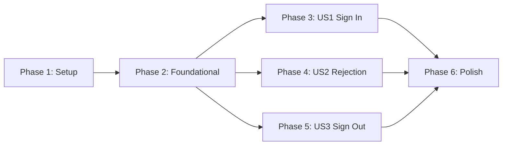

# Tasks: Google Authentication via Firebase

**Input**: Design documents from `/specs/001-google-auth/`
**Prerequisites**: plan.md, spec.md, research.md, data-model.md, contracts/

**Tests**: Not explicitly requested - manual testing via quickstart.md checklist

**Organization**: Tasks are grouped by user story to enable independent implementation and testing of each story.

## Format: `[ID] [P?] [Story] Description`

- **[P]**: Can run in parallel (different files, no dependencies)
- **[Story]**: Which user story this task belongs to (e.g., US1, US2, US3)
- Include exact file paths in descriptions

## User Stories Mapping

| Story | Priority | Description |
|-------|----------|-------------|
| US1 | P1 | Sign In with Google |
| US2 | P1 | Unauthorized User Rejection |
| US3 | P2 | Sign Out |

---

## Phase 1: Setup (Shared Infrastructure)

**Purpose**: Install dependencies and create environment configuration

- [x] T001 Install Firebase dependency: `npm install firebase`
- [x] T002 [P] Create `.env.local` file with Firebase configuration template (NEXT_PUBLIC_FIREBASE_* and NEXT_PUBLIC_ALLOWED_EMAILS)
- [x] T003 [P] Update `.gitignore` to include `.env.local` if not already present
- [x] T004 [P] Create `src/lib/` directory structure

---

## Phase 2: Foundational (Blocking Prerequisites)

**Purpose**: Core authentication infrastructure that MUST be complete before ANY user story can be implemented

**⚠️ CRITICAL**: No user story work can begin until this phase is complete

- [x] T005 Create Firebase initialization in `src/lib/firebase.ts` with environment variable config
- [x] T006 [P] Create auth types in `src/types/auth.ts` (AuthUser, AuthError, AuthErrorType, AuthContextValue)
- [x] T007 Create `src/components/auth/` directory structure
- [x] T008 Implement AuthProvider component in `src/components/auth/AuthProvider.tsx` with React Context
- [x] T009 Implement useAuth hook in `src/hooks/useAuth.ts` exposing AuthContextValue
- [x] T010 Update root layout `src/app/layout.tsx` to wrap app with AuthProvider

**Checkpoint**: Foundation ready - AuthProvider is in place, useAuth hook is available throughout the app

---

## Phase 3: User Story 1 - Sign In with Google (Priority: P1) 🎯 MVP

**Goal**: Allow authorized user (90joelmarquez@gmail.com) to sign in with Google and access the shopping list

**Independent Test**:
1. Visit `/` → Redirected to `/login`
2. Click "Sign in with Google" → Google popup appears
3. Select allowed Google account → Redirected to shopping list
4. Refresh page → Remain signed in

### Implementation for User Story 1

- [x] T011 [P] [US1] Create LoginButton component in `src/components/auth/LoginButton.tsx` with Google branding
- [x] T012 [P] [US1] Create ProtectedRoute component in `src/components/auth/ProtectedRoute.tsx` with loading state and redirect
- [x] T013 [US1] Create login page in `src/app/login/page.tsx` with LoginButton and app title
- [x] T014 [US1] Update home page `src/app/page.tsx` to wrap content with ProtectedRoute
- [x] T015 [US1] Implement signInWithGoogle method in AuthProvider using Firebase signInWithPopup

**Checkpoint**: User Story 1 complete - Authorized user can sign in and access the app

---

## Phase 4: User Story 2 - Unauthorized User Rejection (Priority: P1)

**Goal**: Reject sign-in attempts from non-allowlisted email addresses with clear error message

**Independent Test**:
1. Visit `/login`
2. Click "Sign in with Google"
3. Select non-allowed Google account
4. See "Access denied" error message
5. Can click "Try again" to attempt with different account

### Implementation for User Story 2

- [x] T016 [P] [US2] Create AuthErrorDisplay component in `src/components/auth/AuthErrorDisplay.tsx` with dismiss action
- [x] T017 [US2] Add email allowlist validation in AuthProvider after successful Google sign-in
- [x] T018 [US2] Implement error state handling in AuthProvider (set error, auto sign-out on unauthorized)
- [x] T019 [US2] Update login page `src/app/login/page.tsx` to display AuthErrorDisplay when error present
- [x] T020 [US2] Implement clearError method in AuthProvider

**Checkpoint**: User Story 2 complete - Unauthorized users see clear error, can retry with different account

---

## Phase 5: User Story 3 - Sign Out (Priority: P2)

**Goal**: Allow authenticated user to sign out and return to login screen

**Independent Test**:
1. Sign in with allowed account
2. See user info displayed
3. Click "Sign out" button
4. Returned to login screen
5. Try to access `/` directly → Redirected to `/login`

### Implementation for User Story 3

- [x] T021 [P] [US3] Create UserMenu component in `src/components/auth/UserMenu.tsx` with user photo, name, and sign-out button
- [x] T022 [US3] Implement signOut method in AuthProvider using Firebase signOut
- [x] T023 [US3] Update home page `src/app/page.tsx` to display UserMenu in header when authenticated

**Checkpoint**: User Story 3 complete - User can sign out and session ends properly

---

## Phase 6: Polish & Cross-Cutting Concerns

**Purpose**: Improvements that affect multiple user stories

- [x] T024 [P] Add loading spinner component or state for auth operations
- [x] T025 [P] Ensure dark mode styling on login page matches app theme
- [x] T026 [P] Ensure mobile-first responsive design on login page
- [x] T027 Run quickstart.md validation checklist manually
- [x] T028 Verify all acceptance scenarios from spec.md pass

---

## Dependencies & Execution Order

### Phase Dependencies



- **Setup (Phase 1)**: No dependencies - can start immediately
- **Foundational (Phase 2)**: Depends on Setup completion - BLOCKS all user stories
- **User Stories (Phase 3-5)**: All depend on Foundational phase completion
  - US1 and US2 can proceed in parallel (if staffed)
  - US3 can also run in parallel but logically depends on sign-in working
- **Polish (Phase 6)**: Depends on all user stories being complete

### User Story Dependencies

- **User Story 1 (P1)**: Can start after Foundational (Phase 2) - Core authentication flow
- **User Story 2 (P1)**: Can start after Foundational (Phase 2) - Builds on US1 flow but tests independently
- **User Story 3 (P2)**: Can start after Foundational (Phase 2) - Independent sign-out functionality

### Within Each User Story

- Components before pages
- AuthProvider methods before page integration
- Story complete before moving to next priority (recommended)

### Parallel Opportunities

**Phase 1 (Setup):**
```bash
# Can run in parallel:
T002 + T003 + T004 (different files, no dependencies)
```

**Phase 2 (Foundational):**
```bash
# Can run in parallel after T005:
T006 (types file) - independent
# Then T007 → T008 → T009 → T010 sequentially (dependencies)
```

**Phase 3-5 (User Stories):**
```bash
# After Phase 2 complete, these story groups can run in parallel:
US1: T011 + T012 in parallel, then T013 → T014 → T015
US2: T016 in parallel with T017 → T018 → T019 → T020
US3: T021 in parallel, then T022 → T023
```

---

## Parallel Example: Phase 2 Foundational

```bash
# Sequential dependency chain:
T005 Firebase init
  ↓
T006 [P] Auth types  ← Can run in parallel with T007
T007 Create auth directory
  ↓
T008 AuthProvider
  ↓
T009 useAuth hook
  ↓
T010 Update layout
```

---

## Implementation Strategy

### MVP First (User Story 1 Only)

1. Complete Phase 1: Setup
2. Complete Phase 2: Foundational (CRITICAL - blocks all stories)
3. Complete Phase 3: User Story 1 (Sign In)
4. **STOP and VALIDATE**: Can authorized user sign in and access app?
5. Deploy/demo if ready

### Full Feature (All Stories)

1. Complete Setup + Foundational → Foundation ready
2. Add User Story 1 → Test: authorized sign-in works → MVP!
3. Add User Story 2 → Test: unauthorized rejection works
4. Add User Story 3 → Test: sign-out works
5. Polish phase → Final validation

### Recommended Order

For single developer:
1. Phase 1 (Setup): ~5 minutes
2. Phase 2 (Foundational): ~30 minutes
3. Phase 3 (US1 Sign In): ~20 minutes → **MVP checkpoint**
4. Phase 4 (US2 Rejection): ~15 minutes
5. Phase 5 (US3 Sign Out): ~15 minutes
6. Phase 6 (Polish): ~15 minutes

**Total estimated time**: ~1.5-2 hours

---

## Notes

- [P] tasks = different files, no dependencies
- [Story] label maps task to specific user story for traceability
- Manual testing via quickstart.md checklist (no automated tests requested)
- Firebase project must be configured in Firebase Console before testing
- Environment variables must be set in `.env.local` before app runs
- Commit after each task or logical group
- Stop at any checkpoint to validate story independently
