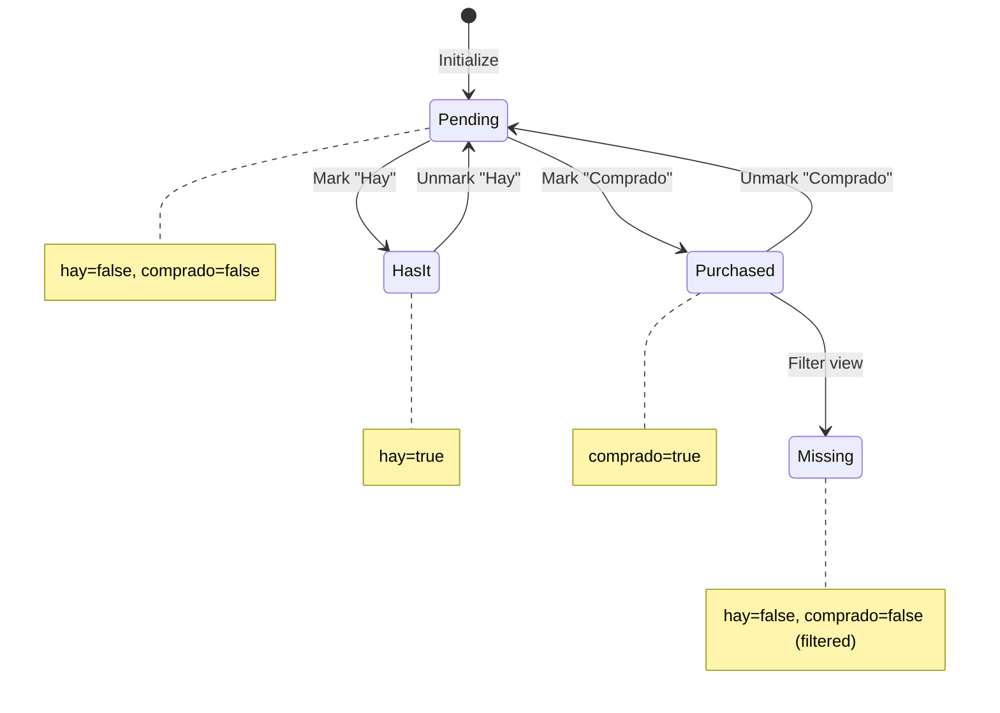
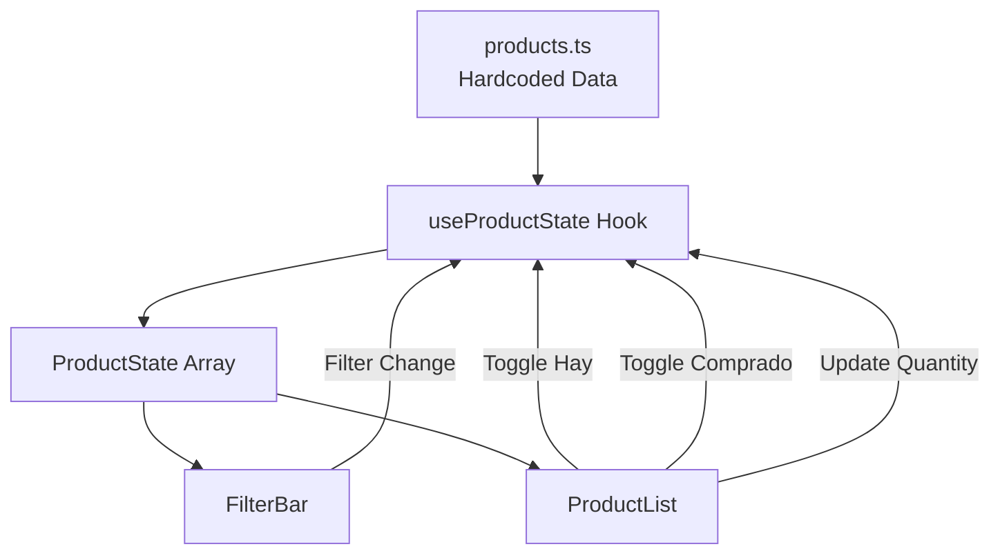

# Data Model: MVP Shopping List

**Branch**: `001-mvp-shopping-list` | **Date**: 2026-01-06

## Overview

El MVP utiliza datos hardcodeados sin persistencia. Este documento define la estructura de datos para facilitar futura migración a Firestore.

---

## Entities

### Product (Base Data - Immutable)

Representa un producto de la lista de compras con sus datos base.

```typescript
interface Product {
  /** Unique identifier for the product */
  id: string

  /** Display name of the product */
  name: string

  /** URL to the product page on the supermarket website (optional) */
  url?: string

  /** Default quantity to purchase each month */
  defaultQuantity: number
}
```

**Constraints**:
- `id`: Non-empty string, unique across all products
- `name`: Non-empty string, max 100 characters
- `url`: Valid URL format if provided, must be HTTPS
- `defaultQuantity`: Non-negative integer (0-99)

**Example**:
```typescript
{
  id: "procenex-pisos",
  name: "Procenex / Poet Pisos",
  url: "https://www.changomas.com.ar/procenex-pisos/p",
  defaultQuantity: 4
}
```

---

### ProductState (Session State - Mutable)

Extiende Product con el estado actual durante la sesión del usuario.

```typescript
interface ProductState extends Product {
  /** Current quantity to purchase (user-editable) */
  quantity: number

  /** Whether the user already has this product at home */
  hay: boolean

  /** Whether the product was successfully purchased/added to cart */
  comprado: boolean
}
```

**Constraints**:
- `quantity`: Non-negative integer (0-99)
- `hay`: Boolean, defaults to `false`
- `comprado`: Boolean, defaults to `false`

**State Transitions**:



---

### FilterType (Enum)

Tipos de filtro disponibles para la lista.

```typescript
type FilterType = 'ALL' | 'PENDING' | 'MISSING'
```

| Value | Description | Filter Logic |
|-------|-------------|--------------|
| `ALL` | Mostrar todos los productos | Sin filtro |
| `PENDING` | Productos a comprar | `hay === false` |
| `MISSING` | Productos que faltaron | `hay === false && comprado === false` |

---

## Data Flow



---

## Initial Data Format

Archivo `src/data/products.ts`:

```typescript
import { Product } from '@/types/product'

export const products: Product[] = [
  {
    id: "procenex-pisos",
    name: "Procenex / Poet Pisos",
    url: "https://www.changomas.com.ar/...",
    defaultQuantity: 4
  },
  {
    id: "blem-aerosol",
    name: "Blem aerosol",
    url: "https://www.changomas.com.ar/...",
    defaultQuantity: 3
  },
  // ... más productos
]
```

---

## State Initialization

Al cargar la aplicación, cada `Product` se convierte a `ProductState`:

```typescript
const initializeState = (products: Product[]): ProductState[] => {
  return products.map(product => ({
    ...product,
    quantity: product.defaultQuantity,
    hay: false,
    comprado: false
  }))
}
```

---

## Validation Rules

### Quantity Input
- Must be a non-negative integer
- Empty input treated as 0
- Maximum value: 99
- Invalid input rejected (keep previous value)

### Checkbox States
- `hay` and `comprado` are independent (not mutually exclusive)
- A product can be both `hay` and `comprado` (edge case, allowed)

---

## Future Migration Notes

When migrating to Firestore:

1. **Products Collection**: Store base `Product` data
   - Document ID = `product.id`
   - Fields: `name`, `url`, `defaultQuantity`

2. **UserLists Collection**: Store user-specific state
   - Document ID = `userId_monthYear` (e.g., `user123_2026-01`)
   - Subcollection: `items` with `ProductState` minus base fields
   - Fields per item: `productId`, `quantity`, `hay`, `comprado`

3. **Security Rules**: User can only read/write own lists
