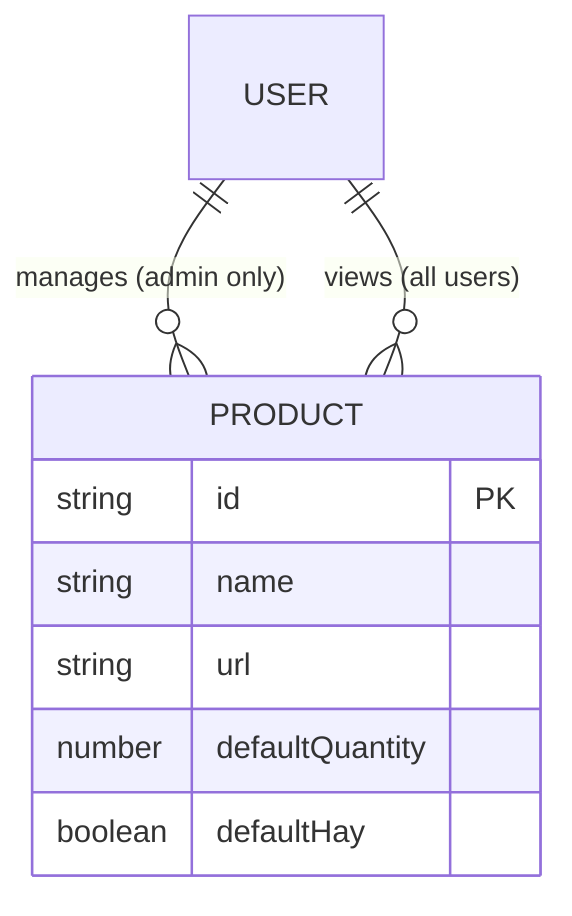

# Data Model: Product Storage

**Date**: 2026-01-13
**Feature**: 001-product-storage

## Entities

### Product

Represents a household item in the shopping catalog.

| Field | Type | Required | Default | Description |
|-------|------|----------|---------|-------------|
| `id` | string | Yes | - | Unique identifier (document ID in Firestore, matches product slug) |
| `name` | string | Yes | - | Display name of the product (non-empty) |
| `url` | string | No | null | Link to purchase the product online |
| `defaultQuantity` | number | Yes | 0 | Standard quantity to purchase monthly |
| `defaultHay` | boolean | No | false | Whether user typically already has this item |

**Firestore Collection**: `products`
**Document ID Strategy**: Use the existing `id` field (product slug) as document ID for stable references

### Validation Rules

| Field | Rule | Error Message |
|-------|------|---------------|
| `name` | Non-empty string, max 100 chars | "Product name is required" / "Product name too long" |
| `url` | Valid URL format or empty | "Invalid URL format" |
| `defaultQuantity` | Non-negative integer | "Quantity must be 0 or greater" |
| `id` | Alphanumeric with dashes, unique | "Invalid product ID" / "Product ID already exists" |

### TypeScript Interface

```typescript
/**
 * Product stored in Firestore
 * Matches existing Product interface for backwards compatibility
 */
export interface Product {
  /** Unique identifier (document ID) */
  id: string

  /** Display name of the product */
  name: string

  /** URL to the product page (optional) */
  url?: string

  /** Default quantity to purchase each month */
  defaultQuantity: number

  /** Default "hay" (have it) state */
  defaultHay?: boolean
}

/**
 * Input for creating a new product
 * ID is auto-generated from name if not provided
 */
export interface CreateProductInput {
  name: string
  url?: string
  defaultQuantity?: number
  defaultHay?: boolean
}

/**
 * Input for updating an existing product
 * All fields optional - only provided fields are updated
 */
export interface UpdateProductInput {
  name?: string
  url?: string
  defaultQuantity?: number
  defaultHay?: boolean
}
```

## Relationships



**Notes**:
- Products have no foreign key relationships in this feature
- Future price tracking feature will add `PRICE_HISTORY` entity referencing `PRODUCT.id`
- `ProductState` (session state) is derived from `Product` at runtime, not stored in Firestore

## State Transitions

Products do not have formal state transitions. They are either:
- **Active**: Exists in the `products` collection (visible in shopping list)
- **Deleted**: Removed from collection (no soft delete for simplicity)

## Indexes

Firestore automatically indexes all fields. No composite indexes required for current queries:
- List all products: `getDocs(collection(db, 'products'))`
- Get single product: `getDoc(doc(db, 'products', productId))`

## Migration Mapping

Mapping from existing `src/data/products.ts` to Firestore:

| Source Field | Firestore Field | Notes |
|--------------|-----------------|-------|
| `id` | Document ID + `id` field | Stored in both places for compatibility |
| `name` | `name` | Direct mapping |
| `url` | `url` | Direct mapping |
| `defaultQuantity` | `defaultQuantity` | Direct mapping |
| `defaultHay` | `defaultHay` | Direct mapping, defaults to `false` if undefined |

**Sample Migration Record**:
```json
{
  "id": "procenex-poet-pisos",
  "name": "Procenex / Poet Pisos",
  "url": "https://www.masonline.com.ar/limpiador-desinfectante-de-pisos-poett-lavanda-4-l-2/p",
  "defaultQuantity": 4,
  "defaultHay": false
}
```
