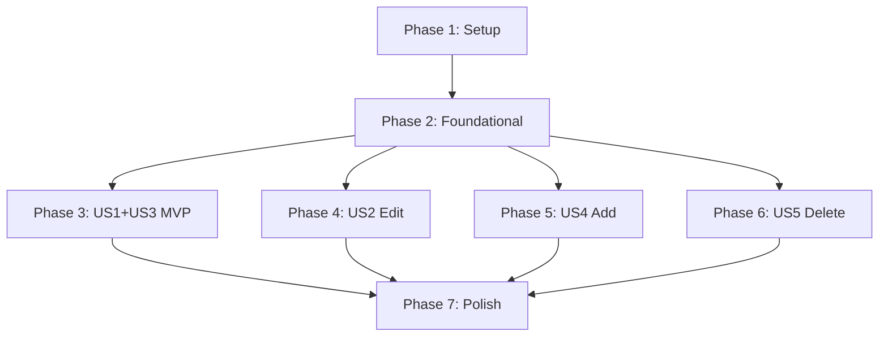

# Tasks: Product Storage

**Input**: Design documents from `/specs/001-product-storage/`
**Prerequisites**: plan.md, spec.md, research.md, data-model.md, contracts/

**Tests**: Not explicitly requested in spec - test tasks NOT included.

**Organization**: Tasks grouped by user story for independent implementation and testing.

## Format: `[ID] [P?] [Story?] Description`

- **[P]**: Can run in parallel (different files, no dependencies)
- **[Story]**: Which user story this task belongs to (US1, US2, etc.)
- Exact file paths included in descriptions

---

## Phase 1: Setup (Shared Infrastructure)

**Purpose**: Project initialization and Firestore configuration

- [x] T001 Add Firestore to Firebase initialization in src/lib/firebase.ts
- [x] T002 [P] Create services directory at src/services/
- [x] T003 [P] Create scripts directory at src/scripts/
- [x] T004 [P] Create admin components directory at src/components/admin/
- [x] T005 Add CreateProductInput and UpdateProductInput types to src/types/product.ts
- [x] T006 Create ServiceResult type in src/types/service.ts

**Checkpoint**: Infrastructure ready for service implementation

---

## Phase 2: Foundational (Blocking Prerequisites)

**Purpose**: Core product service that ALL user stories depend on

**⚠️ CRITICAL**: No user story work can begin until this phase is complete

- [x] T007 Implement getAllProducts() in src/services/productService.ts
- [x] T008 Implement getProduct(id) in src/services/productService.ts
- [x] T009 Implement productExists(id) in src/services/productService.ts
- [x] T010 Create useProducts hook in src/hooks/useProducts.ts
- [x] T011 Deploy Firestore security rules from specs/001-product-storage/contracts/firestore.rules

**Checkpoint**: Foundation ready - user story implementation can begin

---

## Phase 3: User Story 1 + 3 - Initial Load & View Products (Priority: P1) 🎯 MVP

**Goal**: Migrate 55 hardcoded products to Firestore and display them in the app

**Independent Test**: Run seed script, then open app and verify all 55 products display correctly

### Implementation for US1 (Initial Product Load)

- [x] T012 [US1] Implement seedProducts() batch write in src/services/productService.ts
- [x] T013 [US1] Create migration script in src/scripts/seedProducts.ts
- [x] T014 [US1] Add npm script for seed command in package.json

### Implementation for US3 (View All Products)

- [x] T015 [US3] Update src/app/page.tsx to use useProducts hook instead of static import
- [x] T016 [US3] Add loading state UI to ProductList in src/components/ProductList.tsx
- [x] T017 [US3] Add error state UI to ProductList in src/components/ProductList.tsx
- [x] T018 [US3] Remove static products import from src/app/page.tsx

**Checkpoint**: MVP complete - app fetches products from Firestore, seed script works

---

## Phase 4: User Story 2 - Edit Product Name and URL (Priority: P2)

**Goal**: Allow admins to edit product name and URL through an admin interface

**Independent Test**: Navigate to admin/products, click edit on a product, change name/URL, save, verify changes persist after refresh

### Implementation for US2

- [x] T019 [US2] Implement updateProduct() in src/services/productService.ts
- [x] T020 [US2] Create useProductMutations hook in src/hooks/useProductMutations.ts
- [x] T021 [P] [US2] Create ProductForm component in src/components/admin/ProductForm.tsx
- [x] T022 [P] [US2] Create ProductTable component in src/components/admin/ProductTable.tsx
- [x] T023 [US2] Create admin products page at src/app/admin/products/page.tsx
- [x] T024 [US2] Create admin layout with auth guard at src/app/admin/layout.tsx
- [x] T025 [US2] Add edit functionality to ProductTable (edit button, inline or modal form)
- [x] T026 [US2] Add validation for empty name in ProductForm

**Checkpoint**: Admins can edit product name and URL

---

## Phase 5: User Story 4 - Add New Product (Priority: P3)

**Goal**: Allow admins to add new products to the catalog

**Independent Test**: Navigate to admin/products, click add, fill form with new product data, save, verify product appears in list

### Implementation for US4

- [x] T027 [US4] Implement createProduct() in src/services/productService.ts
- [x] T028 [US4] Implement slug generation utility in src/lib/utils.ts
- [x] T029 [US4] Add create mutation to useProductMutations hook
- [x] T030 [US4] Add "Add Product" button and form to admin products page
- [x] T031 [US4] Add duplicate ID validation in createProduct service

**Checkpoint**: Admins can add new products

---

## Phase 6: User Story 5 - Delete Product (Priority: P3)

**Goal**: Allow admins to delete products from the catalog with confirmation

**Independent Test**: Navigate to admin/products, click delete on a product, confirm, verify product removed from list

### Implementation for US5

- [x] T032 [US5] Implement deleteProduct() in src/services/productService.ts
- [x] T033 [US5] Add delete mutation to useProductMutations hook
- [x] T034 [US5] Create ConfirmDialog component in src/components/admin/ConfirmDialog.tsx
- [x] T035 [US5] Add delete button with confirmation to ProductTable

**Checkpoint**: Admins can delete products with confirmation

---

## Phase 7: Polish & Cross-Cutting Concerns

**Purpose**: Improvements that affect multiple user stories

- [x] T036 [P] Add link to admin section in main app navigation
- [x] T037 [P] Add mobile-responsive styles to admin components
- [x] T038 Ensure dark mode styling for all admin components
- [ ] T039 Add optimistic updates to useProductMutations for better UX (optional enhancement)
- [x] T040 Deprecate src/data/products.ts with comment (keep for reference)
- [x] T041 Run quickstart.md validation steps
- [x] T042 Update CLAUDE.md if needed for new patterns (no updates needed)

---

## Dependencies & Execution Order

### Phase Dependencies



- **Setup (Phase 1)**: No dependencies - can start immediately
- **Foundational (Phase 2)**: Depends on Setup completion - BLOCKS all user stories
- **US1+US3 (Phase 3)**: Depends on Foundational - MVP increment
- **US2, US4, US5 (Phases 4-6)**: All depend on Foundational, can run in parallel after MVP
- **Polish (Phase 7)**: Depends on desired user stories being complete

### User Story Dependencies

- **US1+US3 (P1)**: First priority, enables all other stories
- **US2 (P2)**: Independent after Phase 2, needs admin UI foundation
- **US4 (P3)**: Independent after Phase 2, shares admin UI with US2
- **US5 (P3)**: Independent after Phase 2, shares admin UI with US2

### Within Each User Story

- Service methods before hooks
- Hooks before UI components
- Base components before page integration

### Parallel Opportunities

**Phase 1 (All parallel):**
- T002, T003, T004 can run together (directory creation)

**Phase 4 (Partial parallel):**
- T021, T022 can run together (independent components)

**Phase 7 (All parallel):**
- T036, T037 can run together

---

## Parallel Example: Phase 1 Setup

```bash
# Launch all directory creation together:
Task: "Create services directory at src/services/"
Task: "Create scripts directory at src/scripts/"
Task: "Create admin components directory at src/components/admin/"
```

## Parallel Example: Phase 4 Admin Components

```bash
# Launch both admin components together:
Task: "Create ProductForm component in src/components/admin/ProductForm.tsx"
Task: "Create ProductTable component in src/components/admin/ProductTable.tsx"
```

---

## Implementation Strategy

### MVP First (Phase 1-3 Only)

1. Complete Phase 1: Setup (~15 min)
2. Complete Phase 2: Foundational (~30 min)
3. Complete Phase 3: US1+US3 MVP (~45 min)
4. **STOP and VALIDATE**: Run seed script, verify app displays products
5. Deploy/demo if ready

**MVP Scope**: 18 tasks (T001-T018)

### Incremental Delivery

1. MVP (Phases 1-3) → Products in Firestore, app works
2. Add US2 (Phase 4) → Admins can edit products
3. Add US4+US5 (Phases 5-6) → Full CRUD capability
4. Polish (Phase 7) → Production-ready

### Full Implementation

All 42 tasks for complete feature with all user stories.

---

## Notes

- [P] tasks = different files, no dependencies
- [Story] label maps task to specific user story
- Each user story is independently testable after Phase 2
- Commit after each task or logical group
- Stop at any checkpoint to validate
- Admin UI tasks (US2, US4, US5) share components - consider parallel execution
